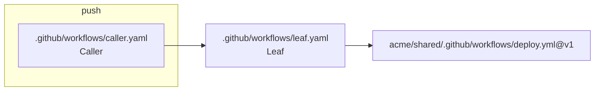

# ravelact

[](https://github.com/wadackel/ravelact/actions/workflows/ci.yaml?query=branch%3Amain)
[](https://crates.io/crates/ravelact)
[](https://github.com/wadackel/ravelact/blob/main/LICENSE)

`ravelact` is a standalone GitHub Actions estate-analysis CLI for reading, tracing, and untangling complex workflow graphs. The name combines `ravel` (to follow and untangle a complicated structure) with `act` (the GitHub Actions domain).

It builds an IR from `.github/workflows/*.{yml,yaml}` and any `action.{yml,yaml}` in the repository, then turns that map into practical answers: what runs from a trigger, who calls a reusable workflow or local action, what a PR diff impacts, which declarations are orphaned, and where wiring, permissions, secrets, or refactor opportunities need attention.

> [!NOTE]
> `ravelact` runs offline against the local repository — no GitHub API calls and no token is required. Local-action discovery prunes derived / VCS-internal directories at any depth: `.git`, `target`, `node_modules`, `dist`, `build`.

## Table of Contents

- [Features](#features)
- [Installation](#installation)
  - [From crates.io](#from-cratesio)
  - [From Binary Releases](#from-binary-releases)
  - [In GitHub Actions](#in-github-actions)
  - [With Nix](#with-nix)
  - [From Source](#from-source)
- [AgentSkill for AI Agents](#agentskill-for-ai-agents)
  - [Install the skill (recommended)](#install-the-skill-recommended)
  - [Install from a local checkout (for skill development)](#install-from-a-local-checkout-for-skill-development)
  - [How drift is prevented](#how-drift-is-prevented)
- [Quick Start](#quick-start)
- [Usage](#usage)
  - [Cheat sheet](#cheat-sheet)
  - [Global flags](#global-flags)
  - [Output format matrix](#output-format-matrix)
  - [Inspect](#inspect)
  - [Check](#check)
  - [Suggest](#suggest)
  - [Export](#export)
  - [Build & cache](#build--cache)
  - [Shell completion](#shell-completion)
  - [Exit codes](#exit-codes)
- [Annotations](#annotations)
  - [What `dispatches` and `triggers` mean](#what-dispatches-and-triggers-mean)
  - [Scope and limitations](#scope-and-limitations)
- [CI Integration](#ci-integration)
  - [PR impact summary](#pr-impact-summary)
  - [Required checks](#required-checks)
  - [Optional hygiene gates](#optional-hygiene-gates)
  - [Graph artifact](#graph-artifact)
- [Documentation](#documentation)
- [License](#license)

## Features

🧭 **Workflow Graph Navigation**
- Trace every workflow reachable from an event with `trace`.
- Ask "who calls this workflow / action?" in reverse with `callers`.
- Export the whole estate as a Mermaid `graph LR` with `graph`.

🔎 **Change Impact & Dead API Detection**
- Feed `git diff --name-only` into `impact` to surface transitively affected entry-point workflows.
- Use `orphans` to find declared-but-unused reusable workflows, local actions, inputs, and outputs in one pass.

🔐 **Permissions & Secrets Audits**
- Analyse caller→callee `permissions` chains using GitHub Actions' monotonic-decrease rule.
- Check `secrets` propagation where each reusable-workflow layer must explicitly opt in.

🛠️ **Refactor Signals**
- Rank composite-action extraction candidates from duplicated step sequences with `extract`.
- Cluster near-duplicate workflows with `dedup` using single-linkage union-find.

🤖 **AI-Agent Ready**
- Ships an [AgentSkill](#agentskill-for-ai-agents) so coding assistants (Claude Code, Copilot, Cursor, Codex, Gemini CLI, …) know which command to run for which question.

## Installation

### From crates.io

```sh
cargo install ravelact
```

### From Binary Releases

Prebuilt binaries are published for macOS (arm64 / x86_64) and Linux (arm64 / x86_64) on every release.

```sh
# Pick your platform asset from the latest release, then:
gh release download --repo wadackel/ravelact --pattern 'ravelact-darwin-arm64'
install -m 0755 ravelact-darwin-arm64 /usr/local/bin/ravelact

ravelact --version
```

The same binary works without `gh`:

```sh
curl -L -o ravelact https://github.com/wadackel/ravelact/releases/latest/download/ravelact-darwin-arm64
install -m 0755 ravelact /usr/local/bin/
```

### In GitHub Actions

Use the repository's setup action to install `ravelact` on GitHub-hosted Linux and macOS runners:

```yaml
- uses: wadackel/ravelact@vX.Y.Z
- run: ravelact --version
```

Replace `vX.Y.Z` with the first ravelact release that includes `action.yaml`, or any newer release. Older release tags cannot be used as the action ref because they do not contain the action metadata. For security-sensitive workflows, pin `wadackel/ravelact` to a full commit SHA and set `version` to the intended ravelact release so both the action code and installed binary are fixed.

When the action is referenced from a branch or commit that is not a `v*` tag, pass `version` explicitly. Use a release tag to install a specific released binary, or `latest` to opt in to the latest GitHub Release:

```yaml
- uses: wadackel/ravelact@vX.Y.Z
  with:
    version: v0.0.5
```

### With Nix

Nix users can install or run `ravelact` directly from the project flake. These commands require Nix with flakes enabled.

Persistent install:

```sh
nix profile install github:wadackel/ravelact
ravelact --version
```

One-off run:

```sh
nix run github:wadackel/ravelact -- --version
```

To pin a release, replace `vX.Y.Z` with an available ravelact release tag:

```sh
nix profile install 'github:wadackel/ravelact?ref=vX.Y.Z'
```

From a local checkout:

```sh
nix profile install .#ravelact
nix run .#ravelact -- --version
```

### From Source

Install from the GitHub repository directly when you want the latest source build:

```sh
cargo install --git https://github.com/wadackel/ravelact --locked
```

For a full development setup (Nix dev shell, `just` recipes, snapshot tests), see [`docs/development.md`](./docs/development.md).

## AgentSkill for AI Agents

`ravelact` ships an [AgentSkill](https://agentskills.io/specification) under [`skills/ravelact/`](./skills/ravelact/) that teaches AI coding agents (GitHub Copilot, Claude Code, Cursor, Codex, Gemini CLI, and many more) **which command fits which question** and **how to interpret each output format** — so you can ask "who calls this reusable workflow?" or "what runs on push?" and the agent picks the right `ravelact` invocation automatically.

### Install the skill (recommended)

Requires **GitHub CLI v2.90.0+** (the `gh skill` command, [GA on 2026-04-16](https://github.blog/changelog/2026-04-16-manage-agent-skills-with-github-cli/)).

```sh
# User-scope install for a specific agent (example: Claude Code)
gh skill install wadackel/ravelact ravelact --agent claude-code --scope user

# Pin to a specific ravelact release
gh skill install wadackel/ravelact ravelact@v0.3.0 --agent claude-code --scope user
```

Run `gh skill install --help` for the full list of supported `--agent` values.

### Install from a local checkout (for skill development)

When iterating on the skill itself, install from the local working tree instead of the published repo:

```sh
gh skill install ./skills/ravelact ravelact --from-local --agent claude-code --scope user --force
```

### How drift is prevented

Each PR runs `script/check-skill-drift.sh` in CI, which asserts that every `ravelact` subcommand printed by `ravelact --help` is also referenced in [`skills/ravelact/SKILL.md`](./skills/ravelact/SKILL.md). The same job runs `gh skill publish --dry-run` to validate the skill against the [agentskills.io specification](https://agentskills.io/specification).

## Quick Start

```sh
# Forward walk: which workflows fire on `push`?
ravelact trace push

# Trigger discovery: which events exist here?
ravelact triggers

# Reverse lookup: who calls this reusable workflow?
ravelact callers .github/workflows/_build.yaml

# PR-diff impact: which entry-points are affected by these changes?
git diff --name-only origin/main... | ravelact impact

# Estate-wide hygiene: declared but unused?
ravelact orphans

# Render the call graph as Mermaid
ravelact graph > graph.mmd
```

Example `trace push` tree output (illustrative — your repo's paths will differ):

```text
trace push  1 entry workflow

╭─ push   (filters=none)
╰─→ .github/workflows/caller.yaml  [wf]
    ╰─→ .github/workflows/leaf.yaml  [wf]
        ╰─→ acme/shared/.github/workflows/deploy.yml  [ext-wf]  @v1
```

The same call graph rendered as Mermaid:



## Usage

`ravelact` ships a flat command surface — every command sits at the top level. `ravelact --help` groups them visually.

### Cheat sheet

| Command | Group | Purpose | Exit code |
|---|---|---|:-:|
| `trace <event>` | Inspect | Forward walk from a trigger event | 0 |
| `triggers` | Inspect | Summary of trigger events declared by workflows | 0 |
| `callers <ref>...` | Inspect | Reverse lookup: who calls these workflows / actions | 0 |
| `impact <files>...` | Inspect | Entry-points transitively affected by changed files | 0 |
| `orphans` | Inspect | Declared-but-unused workflows / actions / inputs / outputs | 0 |
| `permissions` | Check | Effective `permissions:` audit across caller→callee chains | 0/1 |
| `secrets` | Check | `secrets:` propagation audit across reusable-workflow chains | 0/1 |
| `wiring` | Check | Verify dependency edges resolve and dispatches are declared | 0/1 |
| `extract` | Suggest | Composite-action extraction candidates from duplicated steps | 0 |
| `dedup` | Suggest | Near-duplicate workflow clusters | 0 |
| `dump` | Export | Print the IR as JSON | 0 |
| `graph` | Export | Render the call graph as Mermaid `graph LR` | 0 |
| `build` | Other | Build IR and persist the cache | 0 |
| `completion <shell>` | Other | Print shell-completion setup snippet (bash / zsh / fish) | 0 |

### Global flags

The following flags are global and apply to every subcommand:

| Flag | Purpose |
|---|---|
| `--root <path>` | Repository root to scan (default: current working directory). |
| `--no-cache` | Bypass the IR cache (under `${XDG_STATE_HOME}/ravelact/`) and force a full rebuild. |
| `--exclude <glob>` | Exclude local-action manifests whose workspace-relative path matches the glob. Repeatable. Useful for skipping `tests/fixtures/**`-style intentional test data when dogfooding `ravelact` on its own repo, or for narrowing analysis to a sub-tree of a monorepo. Workflow files under `.github/workflows/` are not affected. |
| `--color auto\|always\|never` | Control ANSI colour. `auto` colourises only when stdout is a TTY and `NO_COLOR` is unset; `always` forces colour unless `NO_COLOR` is set; `never` disables it. JSON output never includes ANSI escape codes. |

### Output format matrix

The `--format` flag is opt-in per command. Most report commands accept `text|json|markdown`; `trace` uses command-specific formats (`tree|table|json|markdown`); `graph` emits Mermaid as `text|markdown`. `text`, `tree`, and `table` render human-readable output; `json` emits machine-readable output suitable for `jq`; `markdown` emits a self-contained `### <Section>` heading plus a Markdown table or Mermaid block — ready to drop into a PR comment or GitHub Job Summary.

| Command | Formats | Notes |
|---|---|---|
| `trace` | `tree`, `table`, `json`, `markdown` | Default `tree`; `--ascii` affects `tree` only. |
| `triggers` | `text`, `json`, `markdown` | |
| `callers` | `text`, `json`, `markdown` | |
| `impact` | `text`, `json`, `markdown` | |
| `orphans` | `text`, `json`, `markdown` | |
| `permissions` | `text`, `json`, `markdown` | Exits `1` when findings exist. |
| `secrets` | `text`, `json`, `markdown` | Exits `1` when findings exist. |
| `wiring` | `text`, `json`, `markdown` | Exits `1` when findings exist. |
| `extract` | `text`, `json`, `markdown` | |
| `dedup` | `text`, `json`, `markdown` | |
| `graph` | `text`, `markdown` | Use `dump` for IR JSON. |
| `dump` | fixed JSON | No `--format` flag. |
| `build` | fixed text | No `--format` flag. |
| `completion` | shell snippet | No `--format` flag. |

Human `text` output uses compact status lines such as `impact  no impacted targets` and `dedup  no near-duplicate clusters  (threshold=0.80)` for empty states — when present, the parens-wrapped trailing segment is the run summary (counts, descriptors). Markdown-capable reports keep the longer "No … found" prose for PR comments and GitHub Job Summaries.

### Inspect

Inspect commands are non-blocking reports and exit `0`.

#### `trace <event>`

Forward walk from a trigger (`push`, `pull_request`, `workflow_dispatch`, `schedule`, `workflow_run`, …). `--format tree|table|json|markdown` chooses the output; `--ascii` falls back to ASCII border characters for terminals that mangle Unicode in `tree` output.

When you do not know which trigger event to inspect, run `ravelact triggers` first to list the events declared in the repository.

```sh
ravelact trace push
ravelact trace push --format table
ravelact trace pull_request --type opened --branch main
```

Example tree output:

```text
trace push  1 entry workflow

╭─ push   (filters=none)
╰─→ .github/workflows/caller.yaml  [wf]
    ╰─→ .github/workflows/leaf.yaml  [wf]
        ╰─→ acme/shared/.github/workflows/deploy.yml  [ext-wf]  @v1
```

The trigger event becomes the synthetic root, with every entry workflow hanging off it as a child. Filter metadata (e.g. `filters=none`, `branches=[main]`, `types=[opened]`) appears as a parens-wrapped summary next to the event name, so the status header carries only the count. Table view (below) keeps filter metadata in the status header — see notes for why. When a step has an `if:` guard, the condition appears as a `╰─ if: <expr>` synthetic child line under that step (multi-line block-scalar `if: |` is split per source line and aligned under the `if:` text column, so long expressions never break the connector grid).

For events that have an activity-type concept (`issues`, `pull_request`, `release`, `workflow_run`, …), each entry workflow also gets a `types: …` sub-line that surfaces the matched trigger declaration:

```text
trace issues  3 entry workflows

╭─ issues   (filters=none)
├─→ .github/workflows/labeler.yaml  [wf]
│   ╰─ types: labeled, opened
├─→ .github/workflows/any.yaml      [wf]
│   ╰─ types: any
╰─→ .github/workflows/closed.yaml   [wf]
    ╰─ types: closed
```

The sub-line follows the same `╰─` / `├─` connector grammar as `if:` guards. There are four cases:

- **Explicit list** (`types: [labeled, opened]` in YAML) → `types: labeled, opened`
- **All activity types** — event has `types:` support but the workflow omits the key (e.g. `issues:` with no `types:`) → `types: any`
- **GitHub default subset** — `pull_request` / `pull_request_target` with `types:` omitted → `types: opened, synchronize, reopened (default)`
- **No activity-type concept** — `push`, `schedule`, `workflow_dispatch`, etc. → no sub-line at all

Example table output:

```text
trace push  1 entry workflow  (filters=none)

dep  kind    edge   target                                       note
0    wf      entry  .github/workflows/caller.yaml                entry
1    wf      uses   .github/workflows/leaf.yaml                  reusable
2    ext-wf  uses   acme/shared/.github/workflows/deploy.yml@v1  -
```

In `--format table`, the same trigger metadata is embedded in the entry row's `note` column — for example `entry, types: labeled, opened` for an `issues:` workflow with explicit types — so grep workflows that scan the table stay self-contained.

<details>
<summary>Notes &amp; rendering details</summary>

- **Default format**: `--format tree` renders a Unicode rounded box-drawing tree with the trigger event as a synthetic root (`╭─ <event>   (<summary>)`) and every entry workflow hanging beneath it via `├─→ ` / `╰─→ ` (branch connectors) and `│` (vertical guides), plus a colored `[kind]` tag column on the right (`[wf]` cyan, `[ext-wf]` magenta, `[ac]` cyan, `[ext-ac]` magenta, `[docker]` yellow, `[ann]` cyan, `[cyc]` red). Top-level entry workflows are separated by a single `│` spacer line for breathing room; deeper rows flow tightly to keep related items visually grouped. Step-level `if:` conditions render as a `╰─ if: <expr>` synthetic child line under the guarded step, so multi-line block-scalar guards stay readable without breaking the grid. Pass `--ascii` to fall back to `+- ` / `|-> ` / `\-> ` / `|`.
- **`--format table`**: emits a lightweight 5-column table (`dep / kind / edge / target / note`) suitable for grep, CI logs, and audit diffs. KIND values: `wf` (workflow), `ac` (local action — composite / JavaScript / Docker), `ext-ac` (external action), `ext-wf` (external reusable workflow), `docker` (Docker action ref — `uses: docker://...`), `ann` (annotation edge), `cyc` (cycle guard). Annotation edges (`# ravelact:dispatches` / `triggers`) appear as `ann` rows whose `edge` column carries the verb; the resolved target workflow then appears on the next row as a separate `wf` entry.
- **`--format json`**: emits structured trace entries for machine consumers.
- **`--format markdown`**: emits a `### Trace` heading plus the same trace rows as a Markdown table.
- **Empty result**: when no entry-point workflow matches the requested `<event>`, both `tree` and `table` print the same status header (e.g. `trace schedule  no entry-point matches  (filters=none)`, with a `types=[...]` summary entry when `--type` is set).
- **`--type <name>`**: filters entry-points whose `types:` declaration includes the listed activity (OR semantics across repeats). When omitted, `pull_request` / `pull_request_target` workflows that omit `types:` still match the GitHub default subset (`opened` / `synchronize` / `reopened`). `repository_dispatch.types` (custom `event_type` values) is matched the same way.
- **Ref / path filters**: `--branch <name>`, `--tag <name>`, and `--path <pattern>` (each repeatable) further narrow the result by the trigger's `branches:` / `branches-ignore:` / `tags:` / `tags-ignore:` / `paths:` / `paths-ignore:` filter fields. A trigger that omits a filter is treated as "fires for all values" (matches GitHub Actions behaviour). Repeating a flag is **OR within** that filter; combining different flags is **AND across** filter types. Each `--path X` is interpreted as the **single-file changeset of `X`** — so a workflow with `paths-ignore: [docs/**]` rejects `--path docs/x.md` but accepts `--path src/foo.rs`. Pattern syntax follows the [globset crate's][globset] glob subset; `*`, `**`, `[abc]`, and the leading `!` negation behave per the GitHub [Filter pattern cheat sheet][gha-filter-cheat-sheet], while `?` is treated as exactly one character (vs. GHA's zero-or-one) and the GHA-only `+` quantifier is unsupported. Patterns globset cannot compile print a warning to stderr and are treated as non-matching.

</details>

#### `triggers`

Summarize trigger events declared across `.github/workflows/*.{yml,yaml}`. This is a discovery command for large workflow estates where you may not know whether to start with `trace push`, `trace pull_request`, `trace schedule`, or another event. Use `--format json` for automation or `--format markdown` for PR comments.

```sh
ravelact triggers
```

Example output:

```text
triggers  6 trigger events  (35 trigger declarations)

event              entry workflows  declarations  typed  filtered  examples
push               12               12            0      7         .github/workflows/ci.yml, .github/workflows/lint.yml, .github/workflows/release.yml
pull_request       8                8             3      5         .github/workflows/ci.yml, .github/workflows/test.yml
workflow_call      0                6             0      0         .github/workflows/_build.yml, .github/workflows/_publish.yml
```

Rows are sorted by descending entry workflow count, then event name. `workflow_call` appears because it is important estate context, but it is not an entry-point trigger, so its `entry workflows` count is `0`. `typed` counts explicit `types:` declarations, `filtered` counts branch/tag/path filters, and `examples` is capped at three stable-sorted workflow paths.

#### `callers <ref>...`

Reverse lookup: who calls these workflows / actions. Accepts one or more positional targets, or paths piped via stdin (one per line); `-` mixes stdin with positional args.

```sh
ravelact callers .github/workflows/leaf.yaml
printf '%s\n' .github/workflows/leaf.yaml | ravelact callers
```

Example output:

```text
callers  1 caller for .github/workflows/leaf.yaml

CALLERS
kind      location                       detail
job-call  .github/workflows/caller.yaml  call::_jobcall
```

#### `impact <files>...`

Given a list of changed files (typically a PR diff), list the entry-point workflows transitively affected and the local actions that consume the changed local actions. Inputs may be workflow YAML, `action.yaml`, or any path under a local action directory; unknown paths are warned to stderr and skipped. The input nodes themselves are excluded from the output — only downstream consumers are listed. Inputs may also be piped via stdin (one path per line); `-` mixes stdin with positional args. Each affected entry is rendered with the row label `workflow` for workflows and `local-action-<kind>` (`composite` / `javascript` / `docker`) for local actions.

```sh
git diff --name-only origin/main... | ravelact impact
ravelact impact .github/workflows/_reusable.yaml --format json
```

Example text output:

```text
impact  2 impacted targets  (2 workflows)

WORKFLOWS
  · .github/workflows/entry-a.yaml
  · .github/workflows/entry-b.yaml
```

#### `orphans`

Declared-but-unused report. Four kinds in one pass: reusable workflows / local actions (composite / JavaScript / Docker) that nothing references; declared inputs that the callee body never references; declared outputs that no caller consumes via `needs.<job>.outputs.<X>` or `steps.<id>.outputs.<X>`. Local-action rows are tagged with the kind (`local-action-composite` / `local-action-javascript` / `local-action-docker`) in text output and as `{"id": ..., "kind": "composite|javascript|docker"}` objects under the `actions` key in JSON. Always exits 0.

```sh
ravelact orphans
ravelact orphans --format markdown
```

Example output:

```text
orphans  1 unused declaration  (1 actions)

ACTIONS
kind        target
javascript  .
```

<details>
<summary>Notes &amp; limitations</summary>

- **Scope**: only local callees (`uses: ./.github/workflows/X.yaml` and `uses: ./action-dir`). External (`owner/repo[/sub]@ref`) and cross-repo `workflow_call` are not analysed for declared-but-unused detection.
- **Exit code**: always `0` (informational). `orphans` is hygiene reporting; CI gating is intentionally not coupled to its findings.
- **JS / Docker actions**: `runs.using: node*` and `runs.using: docker` skip the input-reference scan because their `inputs:` are consumed outside YAML (by JS / Docker code). Only `runs.using: composite` actions participate.
- **`workflow_dispatch`-only workflows**: excluded from declared-input / declared-output detection. Only workflows that expose a `workflow_call` signature are scanned.
- **Expression scanning**: only references inside `${{ ... }}` blocks count. Dynamic accesses such as `${{ inputs[var] }}` cause the `unreferenced_inputs` detection to bail out conservatively (no false positives — but no warning if the dynamic key is itself a typo).
- **Step-level `env:` is scanned**, but **job-level `env:` and workflow-level top-level `env:` are not**. References that appear only at job- or workflow-level `env:` can produce false-positive `unreferenced_inputs` entries.
- **Caller-side `with:` validation** (missing required inputs, unknown keys, type mismatches, undeclared input references): not in scope. `actionlint` v1.7+ covers those rules cross-file; run it alongside `ravelact`.

</details>

### Check

Check commands exit `0` when no findings are present and exit `1` when findings exist.

> [!WARNING]
> `permissions`, `secrets`, and `wiring` exit non-zero on findings. Wire them as **required** PR checks deliberately — they will block merges.

#### `permissions`

Compute the effective `permissions:` scope across caller→callee chains using GitHub Actions' "monotonic decrease" rule, and surface unexpected escalations and overly broad scopes. Findings are sorted by severity (high → medium):

- **OverlyBroadCoarse** (high) — an entry-point workflow declares `permissions: write-all` at the workflow or any job level.
- **CalleeEscalatesCaller** (high) — a callee reusable workflow's job declares broader permissions than the caller-job's effective scope for at least one scope (a semantic violation; GitHub caps it at runtime).
- **ImplicitRepoDefault** (medium) — an entry-point workflow declares no `permissions:` at the workflow level and one or more jobs also have no `permissions:`, so the run resolves to the repository default `GITHUB_TOKEN` configuration (which on legacy repos is permissive).

```sh
ravelact permissions
ravelact permissions --format json
```

Example finding output (exits `1` when findings are present):

```text
permissions  1 finding  (1 medium)

  !  medium  implicit-repo-default
  .github/workflows/ci.yaml

    entry-point workflow `.github/workflows/ci.yaml` declares no `permissions:` and jobs [test] inherit the repository default
```

<details>
<summary>Notes &amp; semantics</summary>

- **Scope**: only local callees (`uses: ./.github/workflows/X.yaml`). External (`owner/repo/.github/workflows/X.yml@ref`) and cross-repo `workflow_call` callees are opaque and skipped.
- **Exit code**: `0` when no findings, `1` when one or more findings are reported.
- **Entry-point only for OverlyBroadCoarse and ImplicitRepoDefault**: only fire on workflows whose `on:` lists at least one entry-point trigger (`push` / `pull_request` / `schedule` / `workflow_dispatch` / `workflow_run` / etc.). Reusable-only workflows (`workflow_call` only) inherit their cap from the caller; escalations are caught by `CalleeEscalatesCaller`.
- **`permissions: {}` is explicit, not implicit**: an empty mapping is a deliberate hardening (every scope set to `none`) and does NOT trigger `ImplicitRepoDefault`. Only the absence of the `permissions:` key entirely counts as implicit.
- **Effective scope semantics**: a job's effective scope is `job.permissions.unwrap_or(workflow.permissions)` (job-level fully overrides workflow-level per the GitHub Actions specification — the two are not intersected). Comparison happens per-scope using the ordering `none < read < write`.
- **Coarse forms**: only `read-all` and `write-all` are recognised as fan-outs over the known scope set. Other coarse strings yield no claims (the analyser stays conservative).
- **`metadata`**: implicit-read in GitHub Actions and not a declarable scope. It is not part of the comparison set.

</details>

#### `secrets`

Trace `secrets:` propagation across entry-point → reusable workflow chains using GitHub Actions' "each layer must explicitly opt in" rule (`secrets: inherit` is **not** transitive — every hop must restate it or pass an explicit map). Findings are sorted by severity (high → medium):

- **MissingSecretPropagation** (high) — a directly-called callee declares a `required: true` secret, but the caller's `secrets:` does not pass it (depth = 1).
- **SecretsInheritChainBreak** (high) — in a depth ≥ 2 chain, the leaf callee requires a secret but somewhere along the path a hop dropped it (a missing key in an explicit map, `secrets: {}`, or a layer that omitted `secrets:` and passed nothing forward).
- **EnvironmentInWorkflowCallCallee** (medium) — a reusable callee reached from an entry-point chain has a job-level `environment:` — per the GHA spec the job's environment-scoped secrets shadow any caller-passed secret of the same name, so the caller's intent is silently dropped at runtime.

```sh
ravelact secrets
ravelact secrets --format json
```

Example clean output:

```text
secrets  no findings
```

<details>
<summary>Notes &amp; semantics</summary>

- **Scope**: only local callees (`uses: ./.github/workflows/X.yaml`). External (cross-repo) callees are opaque and skipped.
- **Exit code**: `0` when no findings, `1` when one or more findings are reported.
- **Reachability**: all three findings fire only on chains that DFS reaches from at least one entry-point trigger. Isolated reusable workflows that nothing references are not analysed for `EnvironmentInWorkflowCallCallee`.
- **Path-local reachable set**: each DFS path tracks the set of secret names that have actually reached the current hop. Entry-points start with the symbolic "all names" set; each layer's `secrets:` declaration narrows it. `inherit` only forwards what the current hop actually holds — so `A -(explicit{Y})-> B -(inherit)-> C` carries only `{Y}` to `C`, not all of `A`'s secrets.
- **`SecretsPass` semantics**:
  - `secrets: inherit` — forward the current reachable set unchanged.
  - `secrets: { K1: ..., K2: ... }` — restrict the reachable set to the keys; values are not evaluated, only key presence.
  - `secrets: {}` — drops everything (explicit empty map → reachable becomes `∅`).
  - No `secrets:` key — drops everything (`SecretsPass::None`).
- **Mutually exclusive (a) vs (b)**: for a given secret on a given path, at most one of `MissingSecretPropagation` / `SecretsInheritChainBreak` is emitted. Depth = 1 yields (a); depth ≥ 2 yields (b) regardless of where in the chain the drop occurred.
- **Documented limitations**:
  - **Expression-driven `secrets:` values** (e.g. `secrets: ${{ matrix.foo }}`) parse as `SecretsPass::None` and therefore appear as `MissingSecretPropagation`. Known false positive — runtime expression evaluation is out of scope, mirroring how `orphans` bails on dynamic `${{ inputs[var] }}` accesses.
  - **`${{ secrets.X }}` reference scanning** inside callee bodies is not performed; only `on.workflow_call.secrets[required=true]` declarations participate in (a) and (b).
  - **`on.workflow_call.environment:`** (syntactically invalid per the GHA spec) is the domain of `actionlint`. `secrets` only flags the related runtime hazard — job-level `environment:` in a reusable callee, which silently shadows caller-passed secrets of the same name.

</details>

#### `wiring`

Verify that declared dependency edges resolve and that observable dispatches are declared. Reports four kinds of finding:

1. Unannotated `gh workflow run <X>` invocations inside `run:` blocks — observable dispatches that the IR cannot connect to a target without a `# ravelact:dispatches` annotation.
2. Dangling `# ravelact:` annotations — see [Annotations](#annotations) — whose target path does not resolve.
3. Unresolvable `on.workflow_run.workflows` entries — the named upstream workflow is not present in the local IR.
4. Dangling local `uses: ./<path>` references — step-level local actions or job-level local reusable workflows whose target is not present in the IR. Catches typos and stale paths.

Caller-side `with:` validation (missing required inputs, unknown keys, type mismatches, undeclared input references) is **not** part of `wiring`; `actionlint` v1.7+ covers those rules cross-file. `ravelact` complements `actionlint` with estate-wide declared-but-unused detection (`orphans`), permissions / secrets propagation (`permissions` / `secrets`), and graph queries.

```sh
ravelact wiring
ravelact wiring --format json
```

Example finding output (exits `1` when findings are present):

```text
wiring  1 finding  dangling-local-uses=1

! dangling-local-uses
  location: .github/workflows/ci.yaml:10
  `uses: ./.github/actions/typo` references a local action that is not present in the IR
```

### Suggest

Suggest commands report refactor candidates, never mutate files, and exit `0`.

#### `extract [--min-length N] [--min-occurrences N]`

Detect duplicated step sequences across local workflows / composite actions and emit ranked composite-action extraction candidates with a sketch `action.yml` per candidate. Defaults: `--min-length=3`, `--min-occurrences=2`. Non-mutating — never rewrites files; the sketch is starting material for a manual extraction.

```sh
ravelact extract
ravelact extract --min-length 4 --min-occurrences 3 --format json
```

Example output (excerpt):

```text
extract  1 extraction candidate  min-length=3 min-occurrences=2

-- Candidate 1
score  length  occurrences
8      4       3

-- Occurrences
container                        steps
.github/workflows/a.yaml:build   0..4
.github/workflows/b.yaml:build   0..4
.github/workflows/c.yaml:build   0..4

-- Sketch action.yml
  name: extracted-bootstrap
  description: Extracted from duplicated step sequences. Review and parametrize before using.
  runs:
    using: composite
    steps:
      - uses: actions/checkout@v4
      - uses: actions/setup-node@v4
        # TODO: parametrize via inputs:
      - shell: bash
        run: |
          npm ci
      - uses: actions/cache@v4
        # TODO: parametrize via inputs:
```

The sketch mirrors the duplicated steps it found; review it, parameterize it, and pin action refs to full commit SHAs before adopting.

<details>
<summary>Notes &amp; ranking</summary>

- **Normalization (MVP)**: each step is reduced to a signature — `uses:` target (canonical form) wins over `run:` first non-empty line. Shell preambles (`set -e`, `set -eu`, `set -euo pipefail`) and shebangs are skipped before picking the line. `with:`, `env:`, `if:`, `name:` are intentionally ignored, so two callsites of the same `uses:` target with different `with:` values still match.
- **Sketch `action.yml`**: emitted as a starting template, not a finished composite. `with:` is dropped and replaced with a `# TODO: parametrize via inputs:` comment per `uses:` step that originally carried a `with:`. `run:` bodies are copied verbatim from the first occurrence.
- **Citation format**: `<container>:<job>:<start>..<end>` for workflow steps and `<action_id>:_composite:<start>..<end>` for composite-action steps. Step indices are used in place of source line numbers (the IR currently does not carry line information).
- **Maximal candidates**: when a length-N candidate fully covers a strictly shorter candidate at every occurrence, the shorter candidate is suppressed. A shorter candidate with at least one occurrence outside any longer candidate is emitted alongside.
- **Ranking**: `score = length * (occurrences - 1)` (= the number of duplicated steps the extraction would remove), descending. Ties break by length, occurrences, and citation order.

</details>

#### `dedup [--threshold 0.8]`

Cluster near-duplicate workflows. A weighted Jaccard score over (trigger event names, job ids, step `uses:` references, whitespace-tokenized step `run:` bodies) is computed for every pair of local workflows; pairs scoring at or above the threshold are linked, and clusters are formed via single-linkage union-find. Each cluster is rendered with a representative workflow, member list (with similarity to the representative), shared and divergent `uses:`, and whether trigger sets differ. Non-mutating — reports clusters only; nothing is rewritten or merged.

```sh
ravelact dedup
ravelact dedup --threshold 0.9 --format json
```

Example output (excerpt):

```text
dedup  2 workflow clusters  (threshold=0.80)

CLUSTER 1
metric            value
workflows         2
representative    .github/workflows/ci.yaml
triggers differ   yes

MEMBERS
member                          similarity
.github/workflows/release.yaml  0.83

USES
label      value
common     (none)
divergent  (none)
```

<details>
<summary>Notes &amp; clustering details</summary>

- **Non-mutating**: reports clusters only — `dedup` never rewrites, merges, or deletes any workflow. CI gating uses `--format json`.
- **Scope**: local workflows only. Local actions (composite / JavaScript / Docker) and cross-repo `workflow_call` callees are not dedup targets in this MVP.
- **Default threshold**: `0.8` (inclusive — pairs with similarity equal to the threshold are linked).
- **Similarity formula**: `0.15 * J(triggers) + 0.10 * J(job ids) + 0.40 * J(step uses) + 0.35 * J(run tokens)` where `J` is Jaccard over the feature set. `uses` and `run`-tokens dominate so identifier-only variations across otherwise-identical workflows still cluster, while trigger and job-id differences act as tie-breakers.
- **Run-token similarity**: each step's `run:` body is concatenated per workflow and split on ASCII whitespace into a `BTreeSet`. Identifier differences (URLs, repo names, file paths) typically account for a small fraction of total tokens, so near-duplicates that only differ in identifiers stay above threshold.
- **External `uses:` normalisation**: the version pin (`@ref`) is stripped, so `actions/checkout@v4` and `actions/checkout@v6` are treated as the same use. Intentional — version diversity is noise for near-duplicate detection.
- **Single-linkage clustering**: the cluster header reports the configured threshold, not a guaranteed intra-cluster minimum. Transitive members (A↔B and B↔C above threshold but A↔C below) end up in the same cluster.
- **Representative selection**: the lexicographically smallest workflow path within the cluster. Members are listed in lexicographic order; the representative is not repeated in the member list.
- **`triggers_differ`**: `true` iff at least one cluster member has a different trigger-event set than the others. A single boolean, not a member-aligned matrix.
- **Exit code**: always `0`. CI gating can be added with `--format json` and `jq` (e.g. `ravelact dedup --format json | jq -e 'length == 0'`).

</details>

### Export

Export commands emit output artifacts for downstream tools or renderers.

#### `dump`

Print the IR as JSON.

```sh
ravelact dump
```

Example output (excerpt):

```json
{
  "workflows": [
    {
      "id": ".github/workflows/caller.yaml",
      "name": "Caller"
    }
  ],
  "actions": []
}
```

#### `graph [--event <event>] [--format text|markdown]`

Render the call graph as a Mermaid `graph LR`. Entry workflows are grouped into `subgraph` blocks per trigger event (multi-trigger workflows appear as one alias per trigger); reusable workflows / local actions / external actions are shared nodes; edges follow `uses` / `workflow_call` / `workflow_run`. `--event <event>` filters to entry workflows for a single trigger and is recommended for large estates where the unfiltered graph is too dense to read.

```sh
ravelact graph --event push
ravelact graph --event push --format markdown
```

Example Mermaid output:


Paste the resulting Mermaid into a renderer (mermaid.live, GitHub Flavored Markdown ` ```mermaid ` block, etc.) to visualise the call graph.

`--format text` (default) emits raw Mermaid suitable for `> graph.mmd` or for piping into a renderer. `--format markdown` wraps the same Mermaid in a `### Graph` heading + fenced ` ```mermaid ` block, ready to drop into a PR comment or GitHub Job Summary (GitHub renders ` ```mermaid ` blocks natively). Use `dump` for IR JSON. When `--event <event>` matches no entry-points, the Markdown output still emits the fenced block; the body is a `%% (no entry-point matches event <event>)` diagnostic comment.

### Build & cache

#### `build`

Discover workflows + local actions (composite / JavaScript / Docker), then populate or reuse the IR cache at `${XDG_STATE_HOME}/ravelact/repo-<sha8>/cache.json` (or `$HOME/.local/state/ravelact/...` when `XDG_STATE_HOME` is unset). `--no-cache` forces a rebuild. Prints a status header plus a summary table; the `--format` flag does not apply.

```sh
ravelact build
ravelact build --no-cache
```

Example output:

```text
build  workflow estate index built

-- Summary
metric            value
workflows         12
local actions     3
external actions  5
diagnostics       0
cache             ~/.local/state/ravelact/repo-<sha8>/cache.json
```

All other IR-consuming commands build the IR implicitly on first run via the same code path and reuse the cache thereafter, so `build` is not a prerequisite — it exists as an explicit entry point for pre-warming the cache (e.g. in CI) and printing the cache summary.

#### Cache location

`ravelact` keeps its IR cache under the user state directory, **never** inside your repository:

| Condition | Cache path |
|---|---|
| `XDG_STATE_HOME` set and non-empty | `${XDG_STATE_HOME}/ravelact/repo-<sha8>/cache.json` |
| `XDG_STATE_HOME` unset | `$HOME/.local/state/ravelact/repo-<sha8>/cache.json` |

`<sha8>` is the first 8 hex chars of an FNV-1a hash of the absolute repo path, so separate checkouts never collide and local directory names do not leak into cache paths.

> [!IMPORTANT]
> At least one of `XDG_STATE_HOME` or `HOME` must be set. If both are unset (e.g. in a stripped-down container), every IR-consuming subcommand exits with an error pointing at this requirement; pass `XDG_STATE_HOME=/tmp/ravelact-state` (or any writable directory) to recover.

The cache is keyed by an internal `SCHEMA_VERSION`; schema-changing releases rebuild it automatically. Adopters do **not** need any `.gitignore` entry for `ravelact` — the cache lives outside the repository.

### Shell completion

`ravelact` ships dynamic shell completion for **bash**, **zsh**, and **fish** via [`clap_complete`](https://crates.io/crates/clap_complete)'s `unstable-dynamic` mode. Completion includes subcommand names, flags, `ValueEnum` choices (`--format text|json|markdown` for reports, `--format tree|table|json|markdown` for `trace`, `--format text|markdown` for `graph`), known trigger event names (`push`, `pull_request`, `workflow_dispatch`, …), and workflow / local-action paths under `.github/workflows/` and `.github/actions/` (rooted at `--root` if given, otherwise the current directory).

> [!NOTE]
> Empty-prefix completion intentionally omits flag candidates — type a leading `-` to surface them.

The `ravelact completion <shell>` subcommand prints a setup snippet you can `source` from your shell rc:

| Shell | rc file | Snippet |
|---|---|---|
| bash | `~/.bashrc` | `source <(COMPLETE=bash ravelact)` |
| zsh | `~/.zshrc` | `source <(COMPLETE=zsh ravelact)` |
| fish | `~/.config/fish/config.fish` | `COMPLETE=fish ravelact \| source` |

GitHub CLI extension support is not part of the current distribution path. A future extension would need a separate `gh-ravelact` wrapper because `gh` extensions must use `gh-*` repository and executable names.

### Exit codes

| Group | Commands | Exit code |
|---|---|---|
| Inspect / Suggest / Export | `trace`, `triggers`, `callers`, `impact`, `orphans`, `extract`, `dedup`, `dump`, `graph` | always `0` (informational) |
| Build & cache | `build`, `completion` | always `0` |
| Check | `permissions`, `secrets`, `wiring` | `0` when clean, `1` when any finding is reported |

## Annotations

YAML cannot express every dependency between workflows: a `run:` block can call `gh workflow run X`, a `workflow_run` trigger may chain off another workflow's completion, or an action's code can dispatch a sibling workflow. To make those implicit dependencies queryable, `ravelact` recognises structured comments of the form

```yaml
# ravelact:dispatches .github/workflows/<target>.yaml
# ravelact:triggers   .github/workflows/<target>.yaml
```

Place the comment on its own line, directly above the YAML node it describes:

- A comment immediately above a step attaches to that step.
- A comment between two top-level keys (e.g. between `on:` and `jobs:`) attaches to the next job.
- A comment at the very top of the file attaches to the workflow itself.

Annotated edges show up in `trace`, `callers`, `impact`, and the `graph` output (rendered as `-. dispatches .->` / `-. triggers .->` dotted edges).

### What `dispatches` and `triggers` mean

- **`dispatches`** — "this step / job / workflow imperatively starts the target workflow" (usually via `gh workflow run` or an equivalent dispatch API).
- **`triggers`** — "the target workflow's completion fires this workflow" — the inverse direction of `workflow_run`.

### Scope and limitations

- `<ref>` must be a local workflow path under `.github/workflows/`. Paths with `..`, absolute paths, and external (`owner/repo/...@ref`) targets are rejected and surfaced as `dangling` annotations by `wiring`.
- Comments that fall inside a YAML block scalar (`run: |`, `run: >`) are ignored — they are part of the shell command, not the YAML structure.
- `action.yaml` files **do** parse `# ravelact:` comments. Resolved local-action annotations are stored in the IR on `LocalAction.annotations`: `callers` can report those annotation anchors directly, `trace` / `impact` / `graph` consume reachable annotations when workflows call that local action, and `wiring` reports dangling local-action annotations.
- `wiring` only matches **literal** targets in `gh workflow run X`. Variable expansion (`gh workflow run "$VAR"`), shell line continuation (`\`), and command substitution (`$(...)`) are out of scope and remain known false negatives.

## CI Integration

`ravelact` works well as two kinds of CI step:

- **Gates** — `permissions`, `secrets`, and `wiring` exit `1` when findings are reported, so they can fail the workflow directly.
- **Reports** — `impact`, `trace`, `orphans`, `dedup`, and `graph` are useful for PR summaries, audit logs, optional policy gates, or artifacts. Use `--format json` when a `jq` policy decides whether the report should fail CI.

The examples below install `ravelact` with the repository setup action, then run the CLI from `PATH`. Replace `vX.Y.Z` with the first ravelact release that includes `action.yaml`, or any newer release. For security-sensitive workflows, pin action refs to full commit SHAs and set `version` to the intended ravelact release. To test unreleased changes in this repository, build from source first and replace `ravelact` with `./target/debug/ravelact`.

> [!TIP]
> Pipe `git diff --name-only origin/main...` into `ravelact impact` to surface affected entry-point workflows in PR summaries — this is the highest-signal report for the smallest configuration cost.

### PR impact summary

Drop the following into `.github/workflows/ravelact-impact.yaml` to show which entry-point workflows are affected by the files changed in each PR.

```yaml
name: PR Impact

on:
  pull_request:

permissions:
  contents: read

jobs:
  impact:
    runs-on: ubuntu-latest
    steps:
      - uses: actions/checkout@v4  # Pin to a SHA in production
        with:
          fetch-depth: 0
      - uses: wadackel/ravelact@vX.Y.Z  # Pin to a SHA in production
      - name: Report impacted workflows
        run: |
          git diff --name-only origin/${{ github.base_ref }}...HEAD \
            | ravelact impact --format json \
            | tee ravelact-impact.json

          {
            echo "## ravelact impact"
            echo
            echo '```json'
            cat ravelact-impact.json
            echo '```'
          } >> "$GITHUB_STEP_SUMMARY"
```

### Required checks

`permissions`, `secrets`, and `wiring` are intended for direct CI gating. They print human-readable findings by default and exit non-zero when the report is not clean.

```yaml
name: GitHub Actions Static Checks

on:
  pull_request:
  push:
    branches: [main]

permissions:
  contents: read

jobs:
  ravelact:
    runs-on: ubuntu-latest
    steps:
      - uses: actions/checkout@v4  # Pin to a SHA in production
      - uses: wadackel/ravelact@vX.Y.Z  # Pin to a SHA in production
      - run: ravelact build --root .
      - run: ravelact permissions --root .
      - run: ravelact secrets --root .
      - run: ravelact wiring --root .
```

`actionlint` and `zizmor` both still belong in the same CI suite. `actionlint` validates GitHub Actions syntax, schema, and caller-side `with:` usage. `zizmor` audits security patterns (template-injection, artipacked, excessive-permissions, dangerous-triggers, unpinned-uses, and similar). `ravelact` adds estate-wide graph, permissions-propagation, secrets-propagation, and wiring checks. The three are complementary, not redundant.

### Optional hygiene gates

Informational commands exit `0` by design. Add a `jq` policy when you want to promote a report into a gate:

```yaml
      - name: Fail on near-duplicate workflows
        run: ravelact dedup --root . --format json | jq -e 'length == 0'

      - name: Fail on declared-but-unused workflow API
        run: |
          ravelact orphans --root . --format json \
            | jq -e '
                (.workflows | length) == 0 and
                (.actions | length) == 0 and
                (.unreferenced_inputs | length) == 0 and
                (.unused_outputs | length) == 0
              '
```

Use these gates selectively. `orphans` is strict about every discovered local workflow and local action under the scanned root, so fixture-heavy repositories may prefer to keep it as a scheduled report instead of a PR blocker — or use `--exclude 'tests/fixtures/**'` to scope the analysis.

### Graph artifact

For larger estates, keep a rendered graph source as a build artifact:

```yaml
      - name: Export push graph
        run: ravelact graph --root . --event push > ravelact-push.mmd

      - uses: actions/upload-artifact@v4  # Pin to a SHA in production
        with:
          name: ravelact-graph
          path: ravelact-push.mmd
```

## Documentation

- [`docs/development.md`](./docs/development.md) — build, test, lint, snapshot review, IR cache reference.
- [`CONTRIBUTING.md`](./CONTRIBUTING.md) — contributor on-ramp.

## License

[MIT © wadackel](./LICENSE)

[globset]: https://docs.rs/globset
[gha-filter-cheat-sheet]: https://docs.github.com/en/actions/reference/workflows-and-actions/workflow-syntax#filter-pattern-cheat-sheet
